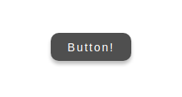

# react-button-oa

> Button Component for React

[](https://www.npmjs.com/package/react-button-oa) [](https://standardjs.com)



## Demo

https://ozanaydin9.github.io/react-button-oa/

## Usage

```jsx
import React from 'react'

import { OzanButtonComponent as Button} from 'react-button-oa'

const App = () => {

  function handleClick() {
      alert("Button clicked!")
  }

  return <Button onClick={handleClick} text="Button!"/>

}

export default App
```

## Props

|    Props      |      Type     |    Default   |
| ------------- | ------------- | ------------ |
| onClick  | function  |  |
| text  | string  | "Button" |
| background  | string  | "#4F4F4F" |
| hoverColor  | string  | "#343434" |
| border  | string  | "none"|
| borderRadius  | string  | "10px" |
| boxShadow  | string  | "0px 4px 4px rgba(0, 0, 0, 0.25)" |
|  |  |  |
| minWidth  | string | "100px" |
| minHeight  | string  | "35px" |
| width  | string  | "auto" |
| height  | string  | "auto" |
| margin  | string  | "0"|
|  |  |  |
| color  | string  | "white" |
| fontSize  | string  | "14px" |
| fontWeight  | string  | "normal" |
| letterSpacing  | string  | "2px" |
|  |  |  |
| outline  | string  | "none" |
| cursor  | string  | "pointer" |
| transform  | string  | "translateY(1px)" |


## License

MIT © [ozanaydin9](https://github.com/ozanaydin9)
